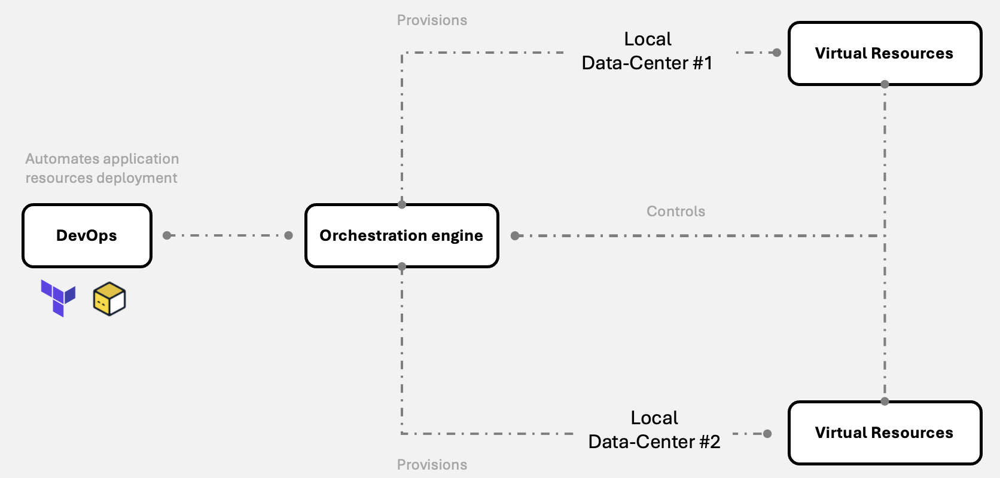
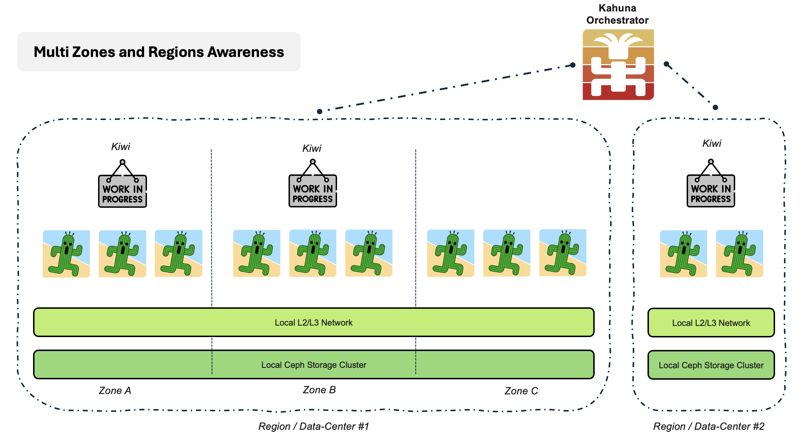

## Conceptual Architecture

Simply put, Kowabunga allows you to control and manage low-level infrastructure at your local on-premises data-centers and spin up various virtual resources on top, as to leverage your applications on top.

Local data centers consist of a bunch of physical machines (can range from personal computers, commodity hardware to high-end enterprise-grade servers) providing raw networking, computing and storage resources. Physical assests plainly sit in your basement. They don't need to be connected to other data-centers, they don't even need to know about others data-centers' existence and more than anything, they don't need to be exposed to public Internet.

From an IT and assets management's perspective, one simply needs to ensure they run and, capacity planning in mind, that they do offer enough physical resources to sustain future applications hosting needs.

On each data-center, some physical machines (usually lightweight) will be dedicated to providing networking kind of services, through Kowabunga's [Kiwi](/docs/concepts/kiwi/) agents, while others will providing computing and storage capabilities, thanks to Kowabunga's [Kaktus](/docs/concepts/kaktus/) agents.

The Kowabunga project then come with [Kahuna](/docs/concepts/kahuna/), its orchestration engine. This is the masterpiece cornerstone of your architecture. Kahuna act as a maestro, providing API servicess for admins and end-users, and provising and controlling virtual resources on the various data-centers through Kowabunga connected agents.

Ultimately, DevOps consumers will only ever interface with [Kahuna](/docs/concepts/kahuna/).

So, how does magic happen ?

**Kahuna** has a triple role exposure:

- **Public REST API**: implements and operates the API calls to manage resources, DevOps-orchestrated, manually (not recommended) or through automation tools such as [Terraform](https://developer.hashicorp.com/terraform), [OpenTofu](https://opentofu.org/) or [Ansible](https://www.ansible.com/).
- **Public WebSocket endoint**: agent connection manager, where the various Kowabunga agents (from managed data-centers) establish secure WebSocket tunnels to, for being further controlled, bypassing on-premises firewall constraints and preventing the need of any public service exposure.
- **Metadata endpoint**: where managed virtual instances and services can retrieve information services and self-configure themselves.

## Core Components

So, let's rewind, the Kowabunga projects consists of multiple core components:

- [Kahuna](/docs/concepts/kahuna/): the core orchestration system. Remotely controls every resource and maintains ecosystem consistent. Gateway to the Kowabunga REST API.
- [Kaktus](/docs/concepts/kaktus/): the HCI node(s). Provides KVM-based virtual computing hypervisor with Ceph-based distributed storage services.
- [Kiwi](/docs/concepts/kiwi/): the SD-WAN node(s). Provides various network services like routing, firewall, DHCP, DNS, VPN, peering (with active-passive failover).
- [Koala](/docs/concepts/koala/): the WebUI. Allows for day-to-day supervision and operation of the various projects and services.

Aside from these, Kowabunga introduces the concept of:

- **Region**: basically a physical location, which can be assimilated to a data-center.
- **Zone**: a specific subset of a region, where all underlying resources are guaranteed to be self-autonomous (in terms of Internet connectivity, power-supply, cooling ...). As with other Cloud providers, the zones allow for application workload distribution within a single region, offering resilience and high-availability.

{}
While **Zones** are part of the same **Region**, they are recommended to be geographically isolated (5 to 30km for example), yet inter-connected through a **sub-millisecond latency**.

Regardless of their respective **Zone**, all physical instances from a given **Region** must share the same L2/L3 physical network backbone (black fiber) to provide efficient distributed storage performances.
{}

## Topology Uses Cases

This illustrates what a Kowabunga Multi-Zones and Regions topology would looks like:

On the left side, one would have a multi-zones region. Divided into 3 Zones (i.e. 3 physically isolated data-centers, physically inter-connected by a network link), the region features 11 servers instances:

- 2 **Kiwi** instances, providing networking capabilities
- 3x3 **Kaktus** instances, providing computing and storage capabilities.

Zones can be pictured in different ways:

- several floors from your personal home basement (ok ... useless ... but for the sake of example).
- several IT rooms from your company's office.
- several buildings from your company's office.

Should a Kowabunga user request for a virtual machine creation in this dedicated region, he could specifically request it to be assigned to one of the 3 zones (the underlying hypervisor from each zone will be automatically picked), or request some -as-a-service feature, which would be seamlessly spawned in multiple zones, as to provide service redundancy.

Sharing the same L2/L3 network across the same region, disk instances will be distributed and replicating across zones, allowing for fast instance relocation in the event of one zone's failure.

On the right side, one would have a single-zone region, with just a couple of physical instances.

{}
Bear in mind that **regions** are autonomous. They can blindly co-exist, with different underlying capabilities and level of services.

One could imagine having a specific region dedicated for staging and one for production workloads (to keep resources isolated from each environment) or even multiple regions, each being specific to a given company or customer.
{}

## What Makes it Different ?

Cloud providers aside, what makes **Kowabunga** different from other on-premises infrastructure and virtualization providers (such as VMware, Nutanix, OpenStack ...).

Well ... 0 licensing costs. Kowabunga is Open Source with no paywalled features. There's no per-CPU or per-GB or memory kind of license. Whether you'd like to set your private small-sized copamy's data-center with 3 servers or full fleet of 200+, your cost of operation will remain flat.

But aside from cost, Kowabunga has been developed by and for DevOps, the ones who:

- need to orchestrate, deploy and maintain heterogenous applications on heterogenous infrastructures.
- use Infrastructure-as-Code principles to ensure reliability, durability and traceability.
- bear security in mind, ensuring than nothing more than what's required must be publicly exposed.
- believe than smaller and simpler is better.

{}
If you're acting as a **Managed Services Provider** (MSP) having to sustain various applications for dozens if not hundreds of customers, **Kowabunga** might come in handy.

Simply picture your various customer on-premises data-centers as Kowabunga regions. All autonomous, un-aware of each others, non-exposed to Internet (hello IT !), yet fully remotely manageable in a single unique way, thanks to [Kahuna](/docs/concepts/kahuna/)'s orchestration !
{}
