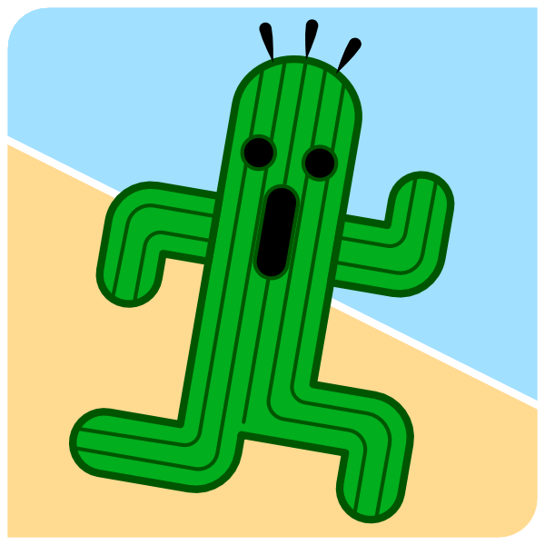

{}

Unlimited, unconditioned, all-in.
{.mt-5}

{}

{}
Core Components
{.h1 .text-left}

Kowabunga features several core infrastructure components, used to expose REST API or provide underlying computing, network and storage capabilities.

{.text-justify-center}

  
  

  The **orchestration system**: remotely controls every resource and maintains ecosystem consistent. Gateway to the Kowabunga REST API.

  
  
  

  Kowabunga **WebUI**: allows for day-to-day supervision and operation of the various projects and services.

  
  
  

  Kowabunga **SD-WAN node**: provides various network services like routing, firewall, DHCP, DNS, VPN, IPSec peering (with active-passive failover).
  
  
  

  Kowabunga **HCI node**: virtual computing hypervisor with distributed storage services.
  


{}

{}
Services
{.h1 .text-left}

Kowabunga features multiple -as-a-service components, which can be seamlessly deployed on your infrastructure.


  
  

  **Kawaii** provides Internet Gateway services. It connects your various project instances to and possibly from Internet, featuring inbound firewall and network VPC and IPSec peering capabilities.
  
  
  

  **Kompute** is the basic building block of your eco-system, providing virtual computing and block storage disks. Granularity scales per CPU and per GB of memory and disk, allowing for fully custom appliances.
  
  
  

  **Konvey** provides standalone TCP/UDP network load-balancer capabilities. It allows for public service exposure while routing incoming requests to several backends.
  
  
  

  **Kylo** provides distributed network file-system capabilities. It is 100% NFSv4 compatible, infinitely scalable and highly resilient and distributed, thanks to underlying Ceph backend.
  


{}
